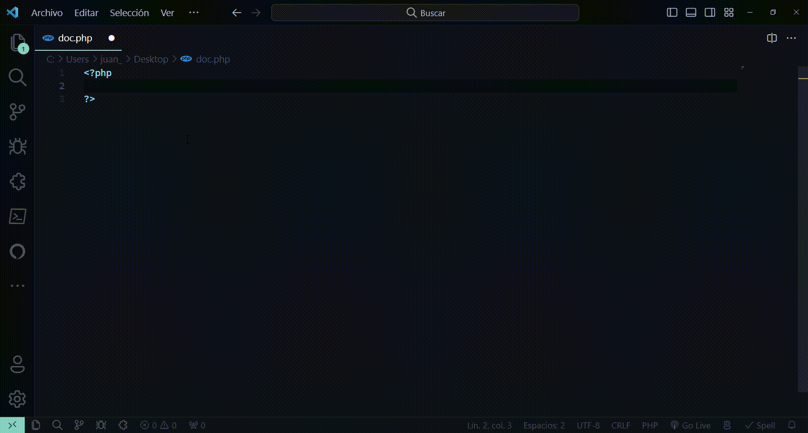

# WHMCS API Snippets

> [!IMPORTANT]
> This extension is not an official product of WHMCS. It is created for educational and collaborative purposes to enhance the user experience.

## Description

This is a set of snippets for Visual Studio Code that make it easier to develop using the WHMCS API `Request (CURL)`. With these snippets, you can quickly access the different methods of the WHMCS API right from your editor.

## How to use

1. Install the extension
2. Open a PHP file
3. Type `w-` and the IntelliSense will show you all the available snippets

## More Information

| Official API       | Documentation                                  |
| ------------------ | -------------------------------------------    |
| [WHMCS API](https://developers.whmcs.com/api/) | [WHMCS API Docs](https://developers.whmcs.com/api/api-index/) |

* [AcceptOrder](https://developers.whmcs.com/api-reference/acceptorder/)
* [AcceptQuote](https://developers.whmcs.com/api-reference/acceptquote/)
* [ActivateModule](https://developers.whmcs.com/api-reference/activatemodule/)
* [AddAnnouncement](https://developers.whmcs.com/api-reference/addannouncement/)
* [AddBannedIp](https://developers.whmcs.com/api-reference/addbannedip/)
* [AddBillableItem](https://developers.whmcs.com/api-reference/addbillableitem/)
* [AddCancelRequest](https://developers.whmcs.com/api-reference/addcancelrequest/)
* [AddClient](https://developers.whmcs.com/api-reference/addclient/)
* [AddClientNote](https://developers.whmcs.com/api-reference/addclientnote/)
* [AddContact](https://developers.whmcs.com/api-reference/addcontact/)
* [AddCredit](https://developers.whmcs.com/api-reference/addcredit/)
* [AddInvoicePayment](https://developers.whmcs.com/api-reference/addinvoicepayment/)
* [AddOrder](https://developers.whmcs.com/api-reference/addorder/)
* [AddPayMethod](https://developers.whmcs.com/api-reference/addpaymethod/)
* [AddProduct](https://developers.whmcs.com/api-reference/addproduct/)
* [AddProjectMessage](https://developers.whmcs.com/api-reference/addprojectmessage/)
* [AddProjectTask](https://developers.whmcs.com/api-reference/addprojecttask/)
* [AddTicketNote](https://developers.whmcs.com/api-reference/addticketnote/)
* [AddTicketReply](https://developers.whmcs.com/api-reference/addticketreply/)
* [AddTransaction](https://developers.whmcs.com/api-reference/addtransaction/)
* [AddUser](https://developers.whmcs.com/api-reference/adduser/)
* [AffiliateActivate](https://developers.whmcs.com/api-reference/affiliateactivate/)
* [ApplyCredit](https://developers.whmcs.com/api-reference/applycredit/)
* [BlockTicketSender](https://developers.whmcs.com/api-reference/blockticketsender/)
* [CancelOrder](https://developers.whmcs.com/api-reference/cancelorder/)
* [CapturePayment](https://developers.whmcs.com/api-reference/capturepayment/)
* [CloseClient](https://developers.whmcs.com/api-reference/closeclient/)
* [CreateClientInvite](https://developers.whmcs.com/api-reference/createclientinvite/)
* [CreateInvoice](https://developers.whmcs.com/api-reference/createinvoice/)
* [CreateOAuthCredential](https://developers.whmcs.com/api-reference/createoauthcredential/)
* [CreateOrUpdateTLD](https://developers.whmcs.com/api-reference/createorupdatetld/)
* [CreateProject](https://developers.whmcs.com/api-reference/createproject/)
* [CreateQuote](https://developers.whmcs.com/api-reference/createquote/)
* [CreateSsoToken](https://developers.whmcs.com/api-reference/createssotoken/)
* [DeactivateModule](https://developers.whmcs.com/api-reference/deactivatemodule/)
* [DecryptPassword](https://developers.whmcs.com/api-reference/decryptpassword/)
* [DeleteAnnouncement](https://developers.whmcs.com/api-reference/deleteannouncement/)
* [DeleteClient](https://developers.whmcs.com/api-reference/deleteclient/)
* [DeleteContact](https://developers.whmcs.com/api-reference/deletecontact/)
* [DeleteOAuthCredential](https://developers.whmcs.com/api-reference/deleteoauthcredential/)
* [DeleteOrder](https://developers.whmcs.com/api-reference/deleteorder/)
* [DeletePayMethod](https://developers.whmcs.com/api-reference/deletepaymethod/)
* [DeleteProjectTask](https://developers.whmcs.com/api-reference/deleteprojecttask/)
* [DeleteQuote](https://developers.whmcs.com/api-reference/deletequote/)
* [DeleteTicket](https://developers.whmcs.com/api-reference/deleteticket/)
* [DeleteTicketNote](https://developers.whmcs.com/api-reference/deleteticketnote/)
* [DeleteTicketReply](https://developers.whmcs.com/api-reference/deleteticketreply/)
* [DeleteUserClient](https://developers.whmcs.com/api-reference/deleteuserclient/)
* [DomainGetLockingStatus](https://developers.whmcs.com/api-reference/domaingetlockingstatus/)
* [DomainGetNameservers](https://developers.whmcs.com/api-reference/domaingetnameservers/)
* [DomainGetWhoisInfo](https://developers.whmcs.com/api-reference/domaingetwhoisinfo/)
* [DomainRegister](https://developers.whmcs.com/api-reference/domainregister/)
* [DomainRelease](https://developers.whmcs.com/api-reference/domainrelease/)
* [DomainRenew](https://developers.whmcs.com/api-reference/domainrenew/)
* [DomainRequestEPP](https://developers.whmcs.com/api-reference/domainrequestepp/)
* [DomainToggleIdProtect](https://developers.whmcs.com/api-reference/domaintoggleidprotect/)
* [DomainTransfer](https://developers.whmcs.com/api-reference/domaintransfer/)
* [DomainUpdateLockingStatus](https://developers.whmcs.com/api-reference/domainupdatelockingstatus/)
* [DomainUpdateNameservers](https://developers.whmcs.com/api-reference/domainupdatenameservers/)
* [DomainUpdateWhoisInfo](https://developers.whmcs.com/api-reference/domainupdatewhoisinfo/)
* [DomainWhois](https://developers.whmcs.com/api-reference/domainwhois/)
* [EncryptPassword](https://developers.whmcs.com/api-reference/encryptpassword/)
* [EndTaskTimer](https://developers.whmcs.com/api-reference/endtasktimer/)
* [FraudOrder](https://developers.whmcs.com/api-reference/fraudorder/)
* [GenInvoices](https://developers.whmcs.com/api-reference/geninvoices/)
* [GetActivityLog](https://developers.whmcs.com/api-reference/getactivitylog/)
* [GetAdminDetails](https://developers.whmcs.com/api-reference/getadmindetails/)
* [GetAdminUsers](https://developers.whmcs.com/api-reference/getadminusers/)
* [GetAffiliates](https://developers.whmcs.com/api-reference/getaffiliates/)
* [GetAnnouncements](https://developers.whmcs.com/api-reference/getannouncements/)
* [GetAutomationLog](https://developers.whmcs.com/api-reference/getautomationlog/)
* [GetCancelledPackages](https://developers.whmcs.com/api-reference/getcancelledpackages/)
* [GetClientGroups](https://developers.whmcs.com/api-reference/getclientgroups/)
* [GetClientPassword](https://developers.whmcs.com/api-reference/getclientpassword/)
* [GetClients](https://developers.whmcs.com/api-reference/getclients/)
* [GetClientsAddons](https://developers.whmcs.com/api-reference/getclientsaddons/)
* [GetClientsDetails](https://developers.whmcs.com/api-reference/getclientsdetails/)
* [GetClientsDomains](https://developers.whmcs.com/api-reference/getclientsdomains/)
* [GetClientsProducts](https://developers.whmcs.com/api-reference/getclientsproducts/)
* [GetConfigurationValue](https://developers.whmcs.com/api-reference/getconfigurationvalue/)
* [GetContacts](https://developers.whmcs.com/api-reference/getcontacts/)
* [GetCredits](https://developers.whmcs.com/api-reference/getcredits/)
* [GetCurrencies](https://developers.whmcs.com/api-reference/getcurrencies/)
* [GetEmailTemplates](https://developers.whmcs.com/api-reference/getemailtemplates/)
* [GetEmails](https://developers.whmcs.com/api-reference/getemails/)
* [GetHealthStatus](https://developers.whmcs.com/api-reference/gethealthstatus/)
* [GetInvoice](https://developers.whmcs.com/api-reference/getinvoice/)
* [GetInvoices](https://developers.whmcs.com/api-reference/getinvoices/)
* [GetModuleConfigurationParameters](https://developers.whmcs.com/api-reference/getmoduleconfigurationparameters/)
* [GetModuleQueue](https://developers.whmcs.com/api-reference/getmodulequeue/)
* [GetOrderStatuses](https://developers.whmcs.com/api-reference/getorderstatuses/)
* [GetOrders](https://developers.whmcs.com/api-reference/getorders/)
* [GetPayMethods](https://developers.whmcs.com/api-reference/getpaymethods/)
* [GetPaymentMethods](https://developers.whmcs.com/api-reference/getpaymentmethods/)
* [GetPermissionsList](https://developers.whmcs.com/api-reference/getpermissionslist/)
* [GetProducts](https://developers.whmcs.com/api-reference/getproducts/)
* [GetProject](https://developers.whmcs.com/api-reference/getproject/)
* [GetProjects](https://developers.whmcs.com/api-reference/getprojects/)
* [GetPromotions](https://developers.whmcs.com/api-reference/getpromotions/)
* [GetQuotes](https://developers.whmcs.com/api-reference/getquotes/)
* [GetRegistrars](https://developers.whmcs.com/api-reference/getregistrars/)
* [GetServers](https://developers.whmcs.com/api-reference/getservers/)
* [GetStaffOnline](https://developers.whmcs.com/api-reference/getstaffonline/) 
* [GetStats](https://developers.whmcs.com/api-reference/getstats/)
* [GetSupportDepartments](https://developers.whmcs.com/api-reference/getsupportdepartments/)
* [GetSupportStatuses](https://developers.whmcs.com/api-reference/getsupportstatuses/)
* [GetTLDPricing](https://developers.whmcs.com/api-reference/gettldpricing/)
* [GetTicket](https://developers.whmcs.com/api-reference/getticket/)
* [GetTicketAttachment](https://developers.whmcs.com/api-reference/getticketattachment/)
* [GetTicketCounts](https://developers.whmcs.com/api-reference/getticketcounts/)
* [GetTicketNotes](https://developers.whmcs.com/api-reference/getticketnotes/)
* [GetTicketPredefinedCats](https://developers.whmcs.com/api-reference/getticketpredefinedcats/)
* [GetTicketPredefinedReplies](https://developers.whmcs.com/api-reference/getticketpredefinedreplies/)
* [GetTickets](https://developers.whmcs.com/api-reference/gettickets/)
* [GetToDoItemStatuses](https://developers.whmcs.com/api-reference/gettodoitemstatuses/)
* [GetToDoItems](https://developers.whmcs.com/api-reference/gettodoitems/)
* [GetTransactions](https://developers.whmcs.com/api-reference/gettransactions/)
* [GetUserPermissions](https://developers.whmcs.com/api-reference/getuserpermissions/)
* [GetUsers](https://developers.whmcs.com/api-reference/getusers/)
* [ListOAuthCredentials](https://developers.whmcs.com/api-reference/listoauthcredentials/)
* [LogActivity](https://developers.whmcs.com/api-reference/logactivity/)
* [MergeTicket](https://developers.whmcs.com/api-reference/mergeticket/)
* [ModuleChangePackage](https://developers.whmcs.com/api-reference/modulechangepackage/)
* [ModuleChangePw](https://developers.whmcs.com/api-reference/modulechangepw/)
* [ModuleCreate](https://developers.whmcs.com/api-reference/modulecreate/)
* [ModuleCustom](https://developers.whmcs.com/api-reference/modulecustom/)
* [ModuleSuspend](https://developers.whmcs.com/api-reference/modulesuspend/)
* [ModuleTerminate](https://developers.whmcs.com/api-reference/moduleterminate/)
* [ModuleUnsuspend](https://developers.whmcs.com/api-reference/moduleunsuspend/)
* [OpenTicket](https://developers.whmcs.com/api-reference/openticket/)
* [OrderFraudCheck](https://developers.whmcs.com/api-reference/orderfraudcheck/)
* [PendingOrder](https://developers.whmcs.com/api-reference/pendingorder/)
* [ResetPassword](https://developers.whmcs.com/api-reference/resetpassword/)
* [SendAdminEmail](https://developers.whmcs.com/api-reference/sendadminemail/)
* [SendEmail](https://developers.whmcs.com/api-reference/sendemail/)
* [SendQuote](https://developers.whmcs.com/api-reference/sendquote/)
* [SetConfigurationValue](https://developers.whmcs.com/api-reference/setconfigurationvalue/)
* [StartTaskTimer](https://developers.whmcs.com/api-reference/starttasktimer/)
* [TriggerNotificationEvent](https://developers.whmcs.com/api-reference/triggernotificationevent/)
* [UpdateAdminNotes](https://developers.whmcs.com/api-reference/updateadminnotes/)
* [UpdateAnnouncement](https://developers.whmcs.com/api-reference/updateannouncement/)
* [UpdateClient](https://developers.whmcs.com/api-reference/updateclient/)
* [UpdateClientAddon](https://developers.whmcs.com/api-reference/updateclientaddon/)
* [UpdateClientDomain](https://developers.whmcs.com/api-reference/updateclientdomain/)
* [UpdateClientProduct](https://developers.whmcs.com/api-reference/updateclientproduct/)
* [UpdateContact](https://developers.whmcs.com/api-reference/updatecontact/)
* [UpdateInvoice](https://developers.whmcs.com/api-reference/updateinvoice/)
* [UpdateModuleConfiguration](https://developers.whmcs.com/api-reference/updatemoduleconfiguration/)
* [UpdateOAuthCredential](https://developers.whmcs.com/api-reference/updateoauthcredential/)
* [UpdatePayMethod](https://developers.whmcs.com/api-reference/updatepaymethod/)
* [UpdateProject](https://developers.whmcs.com/api-reference/updateproject/)
* [UpdateProjectTask](https://developers.whmcs.com/api-reference/updateprojecttask/)
* [UpdateQuote](https://developers.whmcs.com/api-reference/updatequote/)
* [UpdateTicket](https://developers.whmcs.com/api-reference/updateticket/)
* [UpdateTicketReply](https://developers.whmcs.com/api-reference/updateticketreply/)
* [UpdateToDoItem](https://developers.whmcs.com/api-reference/updatetodoitem/)
* [UpdateTransaction](https://developers.whmcs.com/api-reference/updatetransaction/)
* [UpdateUser](https://developers.whmcs.com/api-reference/updateuser/)
* [UpdateUserPermissions](https://developers.whmcs.com/api-reference/updateuserpermissions/)
* [UpgradeProduct](https://developers.whmcs.com/api-reference/upgradeproduct/)
* [ValidateLogin](https://developers.whmcs.com/api-reference/validatelogin/)
* [WhmcsDetails](https://developers.whmcs.com/api-reference/whmcsdetails/)

## License

These snippets are provided under the MIT License. However, please note that WHMCS is a registered trademark. The use of these snippets in connection with WHMCS is subject to the policies and terms of use of WHMCS. Refer to the official WHMCS documentation for more information on the use of their brand and products.